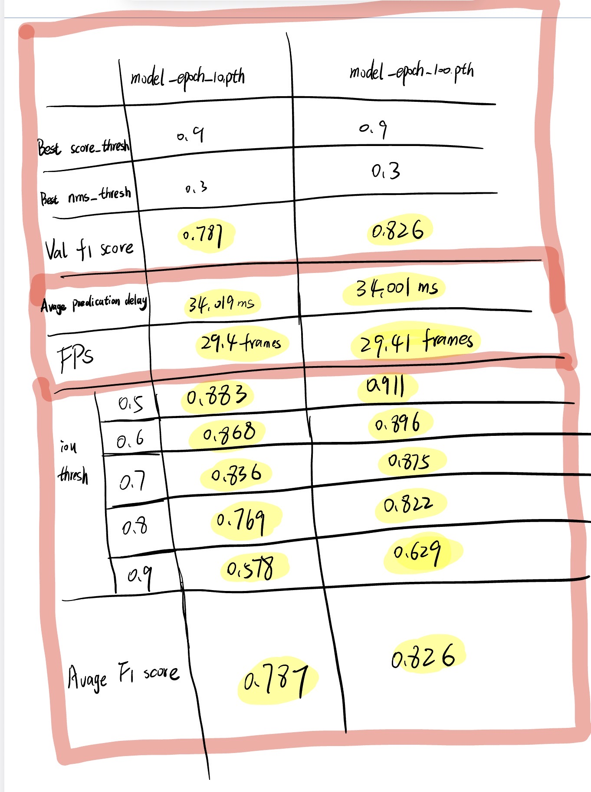

# 1. Training Loss

Because each training session interrupted requires retraining, I save the model every 10 training epochs for later evaluation

**Total Time: 99m 34.3s**

```
Epoch 1/100 - loss 37.206: 100%|██████████| 512/512 [01:03<00:00,  8.10it/s]
Epoch 2/100 - loss 29.838: 100%|██████████| 512/512 [00:58<00:00,  8.70it/s]
Epoch 3/100 - loss 28.206: 100%|██████████| 512/512 [00:58<00:00,  8.70it/s]
Epoch 4/100 - loss 22.274: 100%|██████████| 512/512 [00:59<00:00,  8.67it/s]
Epoch 5/100 - loss 26.478: 100%|██████████| 512/512 [00:58<00:00,  8.69it/s]
Epoch 6/100 - loss 33.835: 100%|██████████| 512/512 [00:58<00:00,  8.69it/s]
Epoch 7/100 - loss 27.429: 100%|██████████| 512/512 [00:59<00:00,  8.68it/s]
Epoch 8/100 - loss 27.859: 100%|██████████| 512/512 [00:58<00:00,  8.69it/s]
Epoch 9/100 - loss 30.371: 100%|██████████| 512/512 [00:58<00:00,  8.69it/s]
Epoch 10/100 - loss 20.424: 100%|██████████| 512/512 [00:58<00:00,  8.69it/s]

Model saved: ./savemodel/model_epoch_10.pth
Epoch 11/100 - loss 36.666: 100%|██████████| 512/512 [00:59<00:00,  8.62it/s]
Epoch 12/100 - loss 15.863: 100%|██████████| 512/512 [00:59<00:00,  8.65it/s]
Epoch 13/100 - loss 21.01: 100%|██████████| 512/512 [00:59<00:00,  8.63it/s] 
Epoch 14/100 - loss 18.758: 100%|██████████| 512/512 [00:59<00:00,  8.67it/s]
Epoch 15/100 - loss 23.057: 100%|██████████| 512/512 [00:59<00:00,  8.65it/s]
Epoch 16/100 - loss 24.475: 100%|██████████| 512/512 [00:59<00:00,  8.66it/s]
Epoch 17/100 - loss 31.456: 100%|██████████| 512/512 [00:59<00:00,  8.63it/s]
Epoch 18/100 - loss 15.235: 100%|██████████| 512/512 [00:59<00:00,  8.63it/s]
Epoch 19/100 - loss 19.945: 100%|██████████| 512/512 [00:59<00:00,  8.65it/s]
Epoch 20/100 - loss 19.042: 100%|██████████| 512/512 [00:59<00:00,  8.65it/s]

Model saved: ./savemodel/model_epoch_20.pth
Epoch 21/100 - loss 29.892: 100%|██████████| 512/512 [00:59<00:00,  8.65it/s]
Epoch 22/100 - loss 23.394: 100%|██████████| 512/512 [00:59<00:00,  8.67it/s]
Epoch 23/100 - loss 28.019: 100%|██████████| 512/512 [00:59<00:00,  8.64it/s]
Epoch 24/100 - loss 22.308: 100%|██████████| 512/512 [00:59<00:00,  8.65it/s]
Epoch 25/100 - loss 19.856: 100%|██████████| 512/512 [00:59<00:00,  8.64it/s]
Epoch 26/100 - loss 21.58: 100%|██████████| 512/512 [00:59<00:00,  8.66it/s] 
Epoch 27/100 - loss 32.891: 100%|██████████| 512/512 [00:59<00:00,  8.64it/s]
Epoch 28/100 - loss 15.334: 100%|██████████| 512/512 [00:58<00:00,  8.68it/s]
Epoch 29/100 - loss 22.272: 100%|██████████| 512/512 [00:59<00:00,  8.64it/s]
Epoch 30/100 - loss 27.523: 100%|██████████| 512/512 [00:59<00:00,  8.62it/s]

Model saved: ./savemodel/model_epoch_30.pth
Epoch 31/100 - loss 19.91: 100%|██████████| 512/512 [00:59<00:00,  8.65it/s] 
Epoch 32/100 - loss 15.011: 100%|██████████| 512/512 [00:59<00:00,  8.67it/s]
Epoch 33/100 - loss 24.922: 100%|██████████| 512/512 [00:59<00:00,  8.63it/s]
Epoch 34/100 - loss 28.02: 100%|██████████| 512/512 [00:59<00:00,  8.67it/s] 
Epoch 35/100 - loss 28.494: 100%|██████████| 512/512 [00:59<00:00,  8.61it/s]
Epoch 36/100 - loss 23.563: 100%|██████████| 512/512 [00:59<00:00,  8.66it/s]
Epoch 37/100 - loss 22.725: 100%|██████████| 512/512 [00:59<00:00,  8.61it/s]
Epoch 38/100 - loss 14.674: 100%|██████████| 512/512 [00:59<00:00,  8.66it/s]
Epoch 39/100 - loss 20.639: 100%|██████████| 512/512 [00:59<00:00,  8.66it/s]
Epoch 40/100 - loss 23.232: 100%|██████████| 512/512 [00:59<00:00,  8.67it/s]

Model saved: ./savemodel/model_epoch_40.pth
Epoch 41/100 - loss 24.932: 100%|██████████| 512/512 [00:59<00:00,  8.65it/s]
Epoch 42/100 - loss 22.246: 100%|██████████| 512/512 [00:58<00:00,  8.68it/s]
Epoch 43/100 - loss 24.192: 100%|██████████| 512/512 [00:59<00:00,  8.63it/s]
Epoch 44/100 - loss 16.698: 100%|██████████| 512/512 [00:59<00:00,  8.67it/s]
Epoch 45/100 - loss 18.832: 100%|██████████| 512/512 [00:59<00:00,  8.64it/s]
Epoch 46/100 - loss 17.945: 100%|██████████| 512/512 [00:59<00:00,  8.64it/s]
Epoch 47/100 - loss 17.876: 100%|██████████| 512/512 [00:59<00:00,  8.64it/s]
Epoch 48/100 - loss 26.896: 100%|██████████| 512/512 [00:59<00:00,  8.66it/s]
Epoch 49/100 - loss 15.519: 100%|██████████| 512/512 [00:59<00:00,  8.64it/s]
Epoch 50/100 - loss 19.118: 100%|██████████| 512/512 [00:59<00:00,  8.66it/s]

Model saved: ./savemodel/model_epoch_50.pth
Epoch 51/100 - loss 21.491: 100%|██████████| 512/512 [00:59<00:00,  8.61it/s]
Epoch 52/100 - loss 18.462: 100%|██████████| 512/512 [00:59<00:00,  8.64it/s]
Epoch 53/100 - loss 16.502: 100%|██████████| 512/512 [00:59<00:00,  8.63it/s]
Epoch 54/100 - loss 18.232: 100%|██████████| 512/512 [00:59<00:00,  8.62it/s]
Epoch 55/100 - loss 26.993: 100%|██████████| 512/512 [00:59<00:00,  8.62it/s]
Epoch 56/100 - loss 14.34: 100%|██████████| 512/512 [00:59<00:00,  8.64it/s] 
Epoch 57/100 - loss 20.456: 100%|██████████| 512/512 [00:59<00:00,  8.64it/s]
Epoch 58/100 - loss 25.602: 100%|██████████| 512/512 [00:59<00:00,  8.62it/s]
Epoch 59/100 - loss 15.582: 100%|██████████| 512/512 [00:59<00:00,  8.64it/s]
Epoch 60/100 - loss 13.144: 100%|██████████| 512/512 [00:59<00:00,  8.66it/s]

Model saved: ./savemodel/model_epoch_60.pth
Epoch 61/100 - loss 24.786: 100%|██████████| 512/512 [00:59<00:00,  8.63it/s]
Epoch 62/100 - loss 18.234: 100%|██████████| 512/512 [00:59<00:00,  8.64it/s]
Epoch 63/100 - loss 18.684: 100%|██████████| 512/512 [00:59<00:00,  8.64it/s]
Epoch 64/100 - loss 16.314: 100%|██████████| 512/512 [00:59<00:00,  8.62it/s]
Epoch 65/100 - loss 20.758: 100%|██████████| 512/512 [00:59<00:00,  8.64it/s]
Epoch 66/100 - loss 22.67: 100%|██████████| 512/512 [00:59<00:00,  8.64it/s] 
Epoch 67/100 - loss 19.043: 100%|██████████| 512/512 [00:59<00:00,  8.60it/s]
Epoch 68/100 - loss 17.295: 100%|██████████| 512/512 [00:59<00:00,  8.66it/s]
Epoch 69/100 - loss 18.927: 100%|██████████| 512/512 [00:59<00:00,  8.64it/s]
Epoch 70/100 - loss 20.792: 100%|██████████| 512/512 [00:59<00:00,  8.65it/s]

Model saved: ./savemodel/model_epoch_70.pth
Epoch 71/100 - loss 21.472: 100%|██████████| 512/512 [00:59<00:00,  8.66it/s]
Epoch 72/100 - loss 15.747: 100%|██████████| 512/512 [00:59<00:00,  8.64it/s]
Epoch 73/100 - loss 21.195: 100%|██████████| 512/512 [00:59<00:00,  8.63it/s]
Epoch 74/100 - loss 13.231: 100%|██████████| 512/512 [00:59<00:00,  8.65it/s]
Epoch 75/100 - loss 19.953: 100%|██████████| 512/512 [00:59<00:00,  8.64it/s]
Epoch 76/100 - loss 15.314: 100%|██████████| 512/512 [00:59<00:00,  8.66it/s]
Epoch 77/100 - loss 18.276: 100%|██████████| 512/512 [00:59<00:00,  8.61it/s]
Epoch 78/100 - loss 25.718: 100%|██████████| 512/512 [00:59<00:00,  8.63it/s]
Epoch 79/100 - loss 15.058: 100%|██████████| 512/512 [00:59<00:00,  8.61it/s]
Epoch 80/100 - loss 16.603: 100%|██████████| 512/512 [00:59<00:00,  8.65it/s]

Model saved: ./savemodel/model_epoch_80.pth
Epoch 81/100 - loss 18.756: 100%|██████████| 512/512 [00:59<00:00,  8.57it/s]
Epoch 82/100 - loss 17.483: 100%|██████████| 512/512 [00:59<00:00,  8.57it/s]
Epoch 83/100 - loss 15.501: 100%|██████████| 512/512 [00:59<00:00,  8.54it/s]
Epoch 84/100 - loss 12.514: 100%|██████████| 512/512 [00:59<00:00,  8.56it/s]
Epoch 85/100 - loss 21.196: 100%|██████████| 512/512 [00:59<00:00,  8.57it/s]
Epoch 86/100 - loss 19.384: 100%|██████████| 512/512 [00:59<00:00,  8.58it/s]
Epoch 87/100 - loss 21.757: 100%|██████████| 512/512 [00:59<00:00,  8.55it/s]
Epoch 88/100 - loss 17.758: 100%|██████████| 512/512 [00:59<00:00,  8.58it/s]
Epoch 89/100 - loss 15.423: 100%|██████████| 512/512 [00:59<00:00,  8.56it/s]
Epoch 90/100 - loss 16.394: 100%|██████████| 512/512 [00:59<00:00,  8.55it/s]

Model saved: ./savemodel/model_epoch_90.pth
Epoch 91/100 - loss 15.919: 100%|██████████| 512/512 [00:59<00:00,  8.63it/s]
Epoch 92/100 - loss 14.934: 100%|██████████| 512/512 [00:59<00:00,  8.64it/s]
Epoch 93/100 - loss 16.044: 100%|██████████| 512/512 [00:59<00:00,  8.64it/s]
Epoch 94/100 - loss 11.284: 100%|██████████| 512/512 [00:59<00:00,  8.64it/s]
Epoch 95/100 - loss 14.21: 100%|██████████| 512/512 [00:59<00:00,  8.64it/s] 
Epoch 96/100 - loss 14.68: 100%|██████████| 512/512 [00:59<00:00,  8.65it/s] 
Epoch 97/100 - loss 32.544: 100%|██████████| 512/512 [00:59<00:00,  8.63it/s]
Epoch 98/100 - loss 20.732: 100%|██████████| 512/512 [00:59<00:00,  8.65it/s]
Epoch 99/100 - loss 15.987: 100%|██████████| 512/512 [00:59<00:00,  8.64it/s]
Epoch 100/100 - loss 14.261: 100%|██████████| 512/512 [00:59<00:00,  8.66it/s]

Model saved: ./savemodel/model_epoch_100.pth
```

# 2. Visualization

1. Results are displayed every 10 epochs

2. I only put 2 screenshots here for your reference (Epoch 1-10  +   Epoch 91-100),and you can zoom in to see numbers clearly

3. Because val_loader batch_size = 4, so it will show 4 pictures every 10 epochs 

- Training: train_loader

- show result: val_loader


#### 2.1 Epoch 1-10


#### 2.2 Epoch 91-100


# 3. Evaluation and FPS measurement

We still use data from **val_loader**

#### 3.1 model_epoch_10.pth

```
Validate (score thresh: 0.6, nms_thresh: 0.3): 100%|██████████| 16/16 [00:22<00:00,  1.44s/it]
Validate (score thresh: 0.6, nms_thresh: 0.5): 100%|██████████| 16/16 [00:21<00:00,  1.34s/it]
Validate (score thresh: 0.6, nms_thresh: 0.8): 100%|██████████| 16/16 [00:43<00:00,  2.74s/it]
Validate (score thresh: 0.8, nms_thresh: 0.3): 100%|██████████| 16/16 [00:14<00:00,  1.13it/s]
Validate (score thresh: 0.8, nms_thresh: 0.5): 100%|██████████| 16/16 [00:17<00:00,  1.08s/it]
Validate (score thresh: 0.8, nms_thresh: 0.8): 100%|██████████| 16/16 [00:31<00:00,  1.98s/it]
Validate (score thresh: 0.9, nms_thresh: 0.3): 100%|██████████| 16/16 [00:13<00:00,  1.21it/s]
Validate (score thresh: 0.9, nms_thresh: 0.5): 100%|██████████| 16/16 [00:15<00:00,  1.06it/s]
Validate (score thresh: 0.9, nms_thresh: 0.8): 100%|██████████| 16/16 [00:23<00:00,  1.47s/it]
Best score_thresh: 0.9
Best nms_thresh: 0.3
Val f1 score: 0.787

```

```
Eval: 100%|██████████| 16/16 [00:17<00:00,  1.07s/it]
Average prediction delay:                                               34.019 ms
FPS:                                                                    29.4 frames
```

```
iou thresh		 f1
0.5 			 0.883
0.6 			 0.868
0.7 			 0.836
0.8 			 0.769
0.9 			 0.578

Average F1 score: 	 0.787
```

#### 3.2 model_epoch_100.pth

```
Validate (score thresh: 0.6, nms_thresh: 0.3): 100%|██████████| 16/16 [00:13<00:00,  1.19it/s]
Validate (score thresh: 0.6, nms_thresh: 0.5): 100%|██████████| 16/16 [00:15<00:00,  1.01it/s]
Validate (score thresh: 0.6, nms_thresh: 0.8): 100%|██████████| 16/16 [00:25<00:00,  1.62s/it]
Validate (score thresh: 0.8, nms_thresh: 0.3): 100%|██████████| 16/16 [00:13<00:00,  1.23it/s]
Validate (score thresh: 0.8, nms_thresh: 0.5): 100%|██████████| 16/16 [00:14<00:00,  1.11it/s]
Validate (score thresh: 0.8, nms_thresh: 0.8): 100%|██████████| 16/16 [00:21<00:00,  1.35s/it]
Validate (score thresh: 0.9, nms_thresh: 0.3): 100%|██████████| 16/16 [00:12<00:00,  1.27it/s]
Validate (score thresh: 0.9, nms_thresh: 0.5): 100%|██████████| 16/16 [00:13<00:00,  1.19it/s]
Validate (score thresh: 0.9, nms_thresh: 0.8): 100%|██████████| 16/16 [00:18<00:00,  1.15s/it]
Best score_thresh: 0.9
Best nms_thresh: 0.3
Val f1 score: 0.826

```

```
Eval: 100%|██████████| 16/16 [00:16<00:00,  1.02s/it]
Average prediction delay:                                               34.001 ms
FPS:                                                                    29.41 frames
```

```
iou thresh		 f1
0.5 			 0.911
0.6 			 0.896
0.7 			 0.875
0.8 			 0.822
0.9 			 0.629

Average F1 score: 	 0.826
```


#### 3.3 Comparison Table


