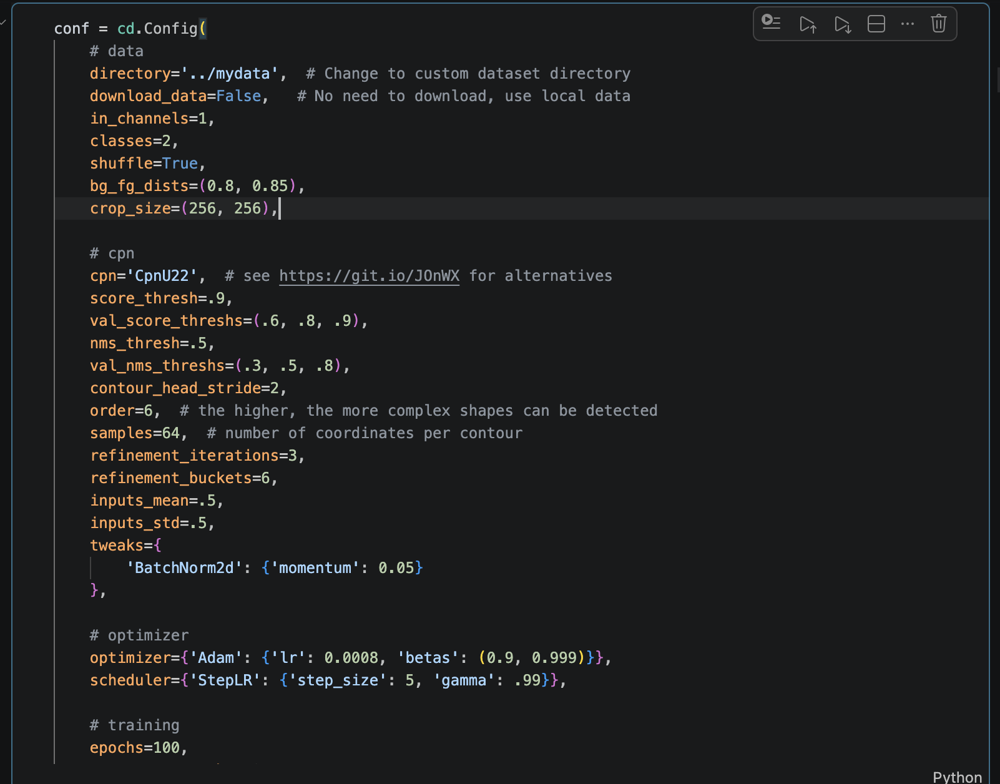
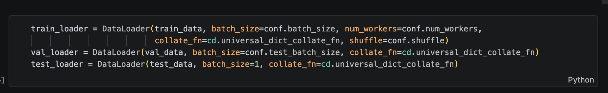
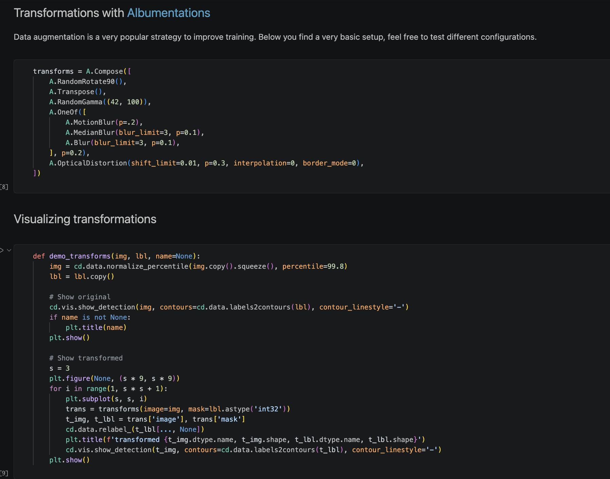
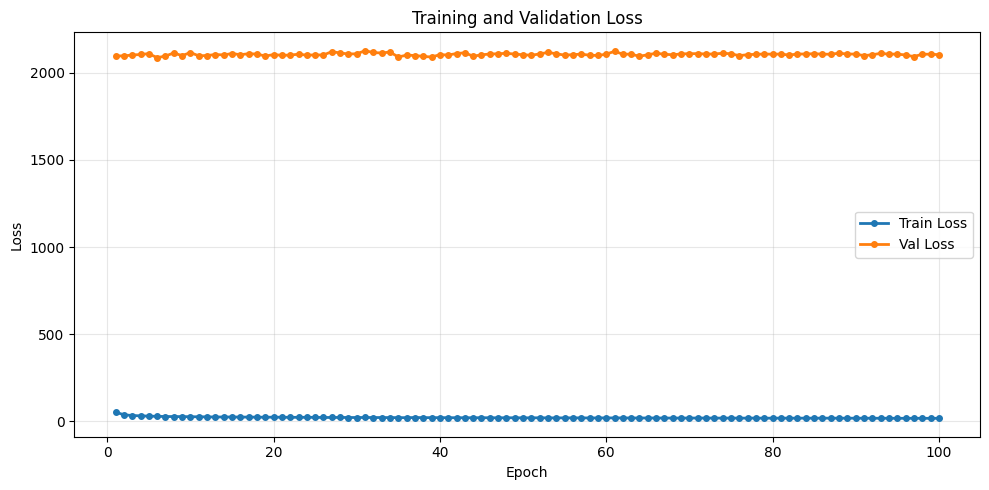
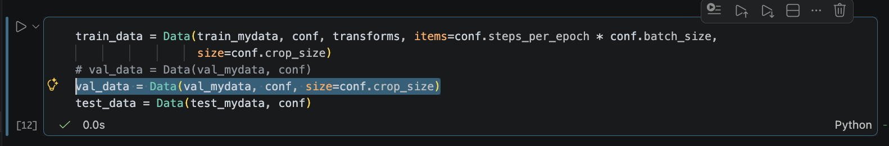
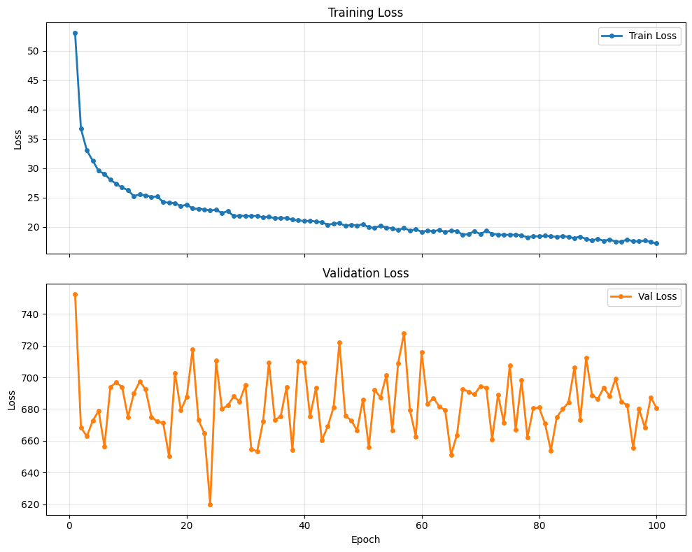
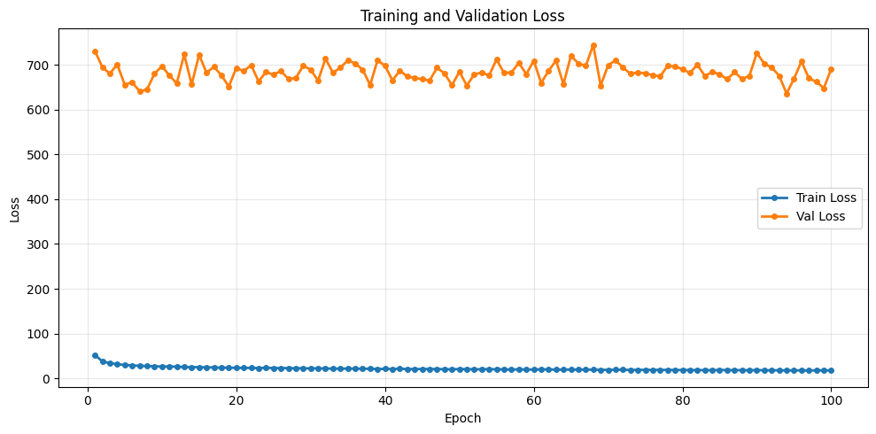

# Problems



The main issue we’re seeing is that our **training loss and validation loss are not computed on the same input scale**, so we can’t directly compare their values.



In our notebook:

- For the **training set**, we use
  `train_data = Data(..., size=conf.crop_size)`
  which means the images are randomly cropped to **256 × 256**.
- For the **validation set**, we use
  `val_data = Data(val_mydata, conf)`
  where we don’t specify a size, so the **full image** is used.

Our original images are **1024 × 512**, which is about **8 times larger in terms of pixel count** compared to the cropped training inputs.

Because of this, the `outputs['loss']` in CPN is likely **not normalized consistently** with respect to the number of pixels, instances, or target locations. During validation, the model sees:

- More pixels
- More instances
- More target locations

As a result, the loss value becomes **much larger**.


In our results, the training loss is only in the **tens**, while the validation loss is around **2100**. This kind of difference doesn’t really look like overfitting, but instead suggests that the **loss is being computed on different scales**.

There’s also a secondary factor:

During training, we apply **data augmentation and random cropping**, so the model only sees **small local regions** of the image.

During validation, however, we use **no augmentation and no cropping**, so the model processes the **entire image**, which has a very different distribution of objects and background.




# Before


#### logs

```
Epoch 1/100 - loss 52.115: 100%|██████████| 512/512 [01:05<00:00,  7.81it/s]
Epoch 001 | train_loss: 53.1353 | val_loss: 2096.1021
Epoch 2/100 - loss 27.331: 100%|██████████| 512/512 [00:59<00:00,  8.64it/s]
Epoch 002 | train_loss: 37.6746 | val_loss: 2096.9835
Epoch 3/100 - loss 32.916: 100%|██████████| 512/512 [00:58<00:00,  8.68it/s]
Epoch 003 | train_loss: 33.6013 | val_loss: 2101.6310
Epoch 4/100 - loss 52.059: 100%|██████████| 512/512 [00:58<00:00,  8.70it/s]
Epoch 004 | train_loss: 31.5297 | val_loss: 2104.8758
Epoch 5/100 - loss 30.877: 100%|██████████| 512/512 [00:58<00:00,  8.69it/s]
Epoch 005 | train_loss: 29.9628 | val_loss: 2109.6748
Epoch 6/100 - loss 29.587: 100%|██████████| 512/512 [00:58<00:00,  8.69it/s]
Epoch 006 | train_loss: 28.8243 | val_loss: 2086.4441
Epoch 7/100 - loss 33.351: 100%|██████████| 512/512 [00:58<00:00,  8.68it/s]
Epoch 007 | train_loss: 27.8096 | val_loss: 2096.0050
Epoch 8/100 - loss 25.817: 100%|██████████| 512/512 [00:58<00:00,  8.69it/s]
Epoch 008 | train_loss: 27.3978 | val_loss: 2113.6264
Epoch 9/100 - loss 26.922: 100%|██████████| 512/512 [00:59<00:00,  8.67it/s]
Epoch 009 | train_loss: 27.2563 | val_loss: 2098.0290
Epoch 10/100 - loss 18.728: 100%|██████████| 512/512 [00:58<00:00,  8.70it/s]
Epoch 010 | train_loss: 26.4365 | val_loss: 2116.1612 
```

# After add "size=conf.crop_size"



#### logs

```
Epoch 1/100 - loss 48.035: 100%|██████████| 512/512 [01:05<00:00,  7.76it/s] 
Epoch 001 | train_loss: 52.9891 | val_loss: 752.6050
Epoch 2/100 - loss 31.907: 100%|██████████| 512/512 [01:01<00:00,  8.28it/s]
Epoch 002 | train_loss: 36.6871 | val_loss: 668.2751
Epoch 3/100 - loss 24.306: 100%|██████████| 512/512 [01:01<00:00,  8.38it/s]
Epoch 003 | train_loss: 33.0100 | val_loss: 662.8882
Epoch 4/100 - loss 28.947: 100%|██████████| 512/512 [01:01<00:00,  8.37it/s]
Epoch 004 | train_loss: 31.2599 | val_loss: 672.5343
Epoch 5/100 - loss 24.618: 100%|██████████| 512/512 [01:01<00:00,  8.39it/s]
Epoch 005 | train_loss: 29.5394 | val_loss: 678.9537
Epoch 6/100 - loss 40.456: 100%|██████████| 512/512 [01:01<00:00,  8.37it/s]
Epoch 006 | train_loss: 28.9900 | val_loss: 656.5058
Epoch 7/100 - loss 23.757: 100%|██████████| 512/512 [01:00<00:00,  8.40it/s]
Epoch 007 | train_loss: 28.0110 | val_loss: 693.9159
Epoch 8/100 - loss 22.759: 100%|██████████| 512/512 [01:01<00:00,  8.35it/s]
Epoch 008 | train_loss: 27.3194 | val_loss: 696.8062
Epoch 9/100 - loss 18.933: 100%|██████████| 512/512 [01:01<00:00,  8.36it/s]
Epoch 009 | train_loss: 26.6954 | val_loss: 693.9621
Epoch 10/100 - loss 25.308: 100%|██████████| 512/512 [01:01<00:00,  8.28it/s]
Epoch 010 | train_loss: 26.2331 | val_loss: 674.9375 

```





I run two notesbooks to plot cuvres of training and validation loss seperately and together. 

```
Epoch 1/100 - loss 43.711: 100%|██████████| 512/512 [01:06<00:00,  7.65it/s]
Epoch 001 | train_loss: 52.2486 | val_loss: 731.1883
Epoch 2/100 - loss 42.489: 100%|██████████| 512/512 [01:01<00:00,  8.36it/s]
Epoch 002 | train_loss: 37.2808 | val_loss: 694.8335
Epoch 3/100 - loss 36.577: 100%|██████████| 512/512 [01:01<00:00,  8.35it/s]
Epoch 003 | train_loss: 33.9415 | val_loss: 680.8174
Epoch 4/100 - loss 33.557: 100%|██████████| 512/512 [01:01<00:00,  8.38it/s]
Epoch 004 | train_loss: 31.3792 | val_loss: 701.3085
Epoch 5/100 - loss 26.826: 100%|██████████| 512/512 [01:01<00:00,  8.36it/s]
Epoch 005 | train_loss: 29.8027 | val_loss: 655.9206
Epoch 6/100 - loss 18.673: 100%|██████████| 512/512 [01:01<00:00,  8.38it/s]
Epoch 006 | train_loss: 28.7597 | val_loss: 661.5990
Epoch 7/100 - loss 38.814: 100%|██████████| 512/512 [01:00<00:00,  8.40it/s]
Epoch 007 | train_loss: 27.7489 | val_loss: 641.0437
Epoch 8/100 - loss 20.455: 100%|██████████| 512/512 [01:01<00:00,  8.34it/s]
Epoch 008 | train_loss: 27.3805 | val_loss: 645.4800
Epoch 9/100 - loss 18.319: 100%|██████████| 512/512 [01:01<00:00,  8.31it/s]
Epoch 009 | train_loss: 26.7989 | val_loss: 680.4457
Epoch 10/100 - loss 23.302: 100%|██████████| 512/512 [01:01<00:00,  8.30it/s]
Epoch 010 | train_loss: 26.1762 | val_loss: 697.3947

```
